```{r setup, include=FALSE}
knitr::opts_chunk$set(echo = TRUE)
```

This lab will be a review of some of the key concepts covered this term. I will cover basic concepts that you are expected to know for the exam as well as common questions I've gotten in office hours. I first provide a list of general topics that I think everyone should know how to do after this course. Then I go into detail on each point in the list.


# List of Topics

Here is a (not necessarily comprehensive) list of things I think are important to understand and know how to do.

* Write a likelihood in terms of [exponential dispersion family](#EF) and identify key components ($\theta$, $b(\theta)$, $a(\phi)$) and understand the link between these components and the mean, variance, and linear predictor.
* [Likelihood equations](le) and [asymptotic distribution](#asymv) of $\hat{\beta}$
* [Interpret coefficients](#int) in glms 
    * Intercepts
    * Main effects
    * Interaction terms
    * Poisson, logistic, multinomial (ordinal and nominal), negative binomial
  
* Derive algorithm to [fit models](#nr)
    * Newton-Raphson
    * Fisher Scoring (same if canonical link is used. Why? data drops out of second derivative of likelihood when we use canonical link so expectation is the same as the observed Hessian).

* Perform [goodness of fit tests](#modelcheck)
    * Deviance test: tests model against saturated mode--low p-value implies poor fit
    * Drop-in-deviance: compares nested models--low p-value means reduced/simpler model doesn't fit well compared to more complex model (i.e. terms you tried to drop were important)
    * Pearson's chi-squared test
    * Compare all to $\chi^2$ distributions 
    
* Residuals

* [Overdispersion](#ov)
    * How can overdispersion occur? (heterogeneity due to: clustering, underlying beta-binomial model )
    * Check with goodness of fit tests
    * Estimate dispersion
    * Account for overdispersion by:
        * adjust standard errors and hypothesis tests
        * Fit quasilikelihood

* [Quasilikelihood](#QL)
    * Derive QL
    * Estimate $\hat{\beta}$
    * Estimate asymptotic variance

* Understand different sampling schemes 
    * [Retrospective](#retro)/case-control vs prospective study coefficient interpretations
    * [Matched case-control](#match) (can't test differences on matched variables)
    * [Contingency tables](#cont) test for independence (Poisson & Multinomial)


# Review

## GLM Basics

__What is the point of GLMs?__ Not all data can be modeled with outcome as linear in the covariates and not all data are normally distributed. GLMs generalize the concepts you learned in terms I and II, allowing for linearity in a function of the data, not necessarily the outcome itself, and allow the data to come from different distributions (like binomial and Poisson, for example).

### Basic Ingrdients

The basic ingredients of a GLM are:

1. The random component, $Y$ with some mean $\mu$
2. The systematic component, $\eta = X\beta$
3. The link function, $g(\mu) = X\beta = \eta$

If we have observations $i = 1,2,...,n$ and covariates (per individual) $j=1,2,...,p$ we model our data as
$$g(\mu_i)=\sum_{j=1}^{p}\beta_jx_{ij}=\eta_i $$

To fit these models, i.e. to get estimates for our parameters $\hat{\beta_j}$ and their standard errors, we have to incorporate the equations above into the likelihood equations.

<a name="EF">
</a>

### Exponential Dispersion Family

We use the exponential dispersion family for our set of possible distributions, whose likelihoods can be written as:

$$ f(y_i;\theta_i,\phi) = exp\Bigg\{\frac{y_i\theta_i-b(\theta_i)}{a(\phi)}+c(y_i,\phi)\Bigg\} $$

or log likelihood

$$L_i = \frac{y_i\theta_i-b(\theta_i)}{a(\phi)}+c(y_i,\phi) $$

Here $\theta$ is called the *natural parameter*. 


We note that the exponential dispersion family satisfies regularity conditions so we can apply the general likelihood results

$$E\bigg(\frac{\delta L}{\delta \theta}\bigg)=0, \text{ and } -E\bigg(\frac{\delta^2 L}{\delta \theta^2}\bigg)=E\bigg(\frac{\delta L}{\delta \theta}\bigg)^2 $$
So, taking the first and second derivatives we get

$$\frac{\delta L_i}{\delta \theta} = \frac{y_i-b'(\theta_i)}{a(\phi)} $$
$$\implies E\bigg(\frac{y_i-b'(\theta_i)}{a(\phi)}\bigg)=0 $$
$$\implies b'(\theta_i) = E(y_i) = \mu_i $$
$$\frac{\delta^2 L_i}{\delta \theta^2} = -\frac{b''(\theta_i)}{a(\phi)} $$

$$\implies -E\bigg(-\frac{b''(\theta_i)}{a(\phi)}\bigg) = \frac{b''(\theta_i)}{a(\phi)} = E\bigg(\frac{y_i-b'(\theta_i)}{a(\phi)}\bigg)^2 $$
where the expectation falls away because we have no data in this expression.

Note that from above we got $\boldsymbol{b'(\theta_i)=\mu_i}$ and $a(\phi)$ and be pulled out of the expectation so we get that 


$$\frac{1}{[a(\phi)]^2}E(y_i-\mu_i)^2 = var(y_i)/[a(\phi)]^2 $$
$$\implies \boldsymbol{var(y_i) = b''(\theta_i)a(\phi) }$$

### Canonical Link

__In practice:__ When given a distribution/likelihood, rearrange it to get it into the form above. This will tell you your $\theta$, $b(\theta)$, and $a(\phi)$. We also then have $b'(\theta)=\mu = g^{-1}(\eta)$. Note that if $g(\cdot)$ is the canonical link, mapping $\theta = \eta$ this gives. $$g(b'(\theta))=g(\mu)=\eta = \theta $$
so the canonical link function is the inverse of $b'(\cdot).$

For example, we know $log(\cdot)$ is the canonical link for the Poisson distribution. 

Here we have $$log(\mu_i)=g(\mu_i)=\eta_i = \theta_i $$

and also $$log(b'(\theta_i)) = \theta_i \implies b'(\theta) = exp(\theta)$$
$$\implies b(\theta)=exp(\theta)  $$

Using the canonical link things simplify to:

$$L_i \propto \frac{y_iX_i^T\beta+b(X_i^T\beta)}{a(\phi)} \\ \implies \frac{\delta L_i}{\delta\beta_j}=\frac{y_ix_{ij}-b'(X_i^T\beta)x_{ij}}{a(\phi)}\\=\frac{(y_i-\mu_i)x_{ij}}{a(\phi)},$$
since we know $b'(\theta_i)=\mu_i$ and in this case $\theta_i=\eta_i=X_i^T\beta$. And for the second derivative we get:
$$\frac{\delta^2 L_i}{\delta\beta_h\delta\beta_j}= -\frac{b''(X_i^T\beta)x_{ih}x_{ij}}{a(\phi)},$$ which is why the observed information is the same as the expected information when we use the canonical link (no data $y_i$ in the equation).

<a name="le">
</a>

### Likelihood Equations

To get our  estimate of $\hat{\beta}$ we need to take the derivative of the log likelihood with respect to $\beta$. While it may not have been clear where $\beta$ came into play in our original expression for $L_i$, we can now see that $$b'(\theta) = \mu_i = g^{-1}\Big(\sum_j \beta_jx_{ij}\Big).$$

Hence, for each observation $i$ and parameter index $j$ $$\frac{\delta L_i}{\delta \beta_j} = \frac{\delta L_i}{\delta\theta_i}\frac{\delta \theta_i}{\delta \mu_i}\frac{\delta \mu_i}{\delta \eta_i}\frac{\delta \eta_i}{\delta \beta_j} $$
$$= \frac{y_i-\mu_i}{a(\phi)}\frac{1}{b''(\theta_i)} \big[g^{-1}(\eta_i)\big]'x_{ij}$$
where the form depends on the link function, relating our mean to our linear predictor.
So, for each $j$ we have the likelihood equations 

$$0=\sum_{i=1}^n\frac{y_i-\mu_i}{a(\phi)}\frac{1}{b''(\theta_i)} \big[g^{-1}(\eta_i)\big]'x_{ij}  \\=\sum_{i=1}^n\frac{y_i-\mu_i}{var(y_i)} \big[g^{-1}(\eta_i)\big]'x_{ij}  $$


__What's the point?__ We model our data in terms of the mean, but our parameter isn't always exactly the mean (unless $b'(\theta) = \theta$ and thus $g(\mu)=\mu$ since the inverse of the identity function is the identity function). The the function $b(\cdot)$ maps our parameter space to the mean, and then the link function $g(\cdot)$ maps the mean to the linear predictor.

<center>

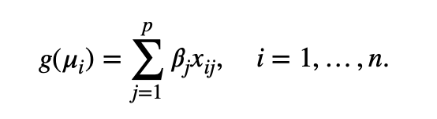

</center>


<a name="nr">
</a>

## Fitting Models

### Newton-Raphson/Fisher Scoring

Often times we cannot get a closed-form solution for the maximum of our likelihood, so we have to solve it numerically. I showed in  Lab 2 one way think about the NR algorithm in terms of maximizing the second order Taylor approximation of the likelihood. Here, I will show an analogous method considering the first order Taylor approximation of the score function  (first derivative of the log likelihood).

Recall that  $$\frac{\delta L}{\delta \beta_j} = \sum_{i=1}^n\frac{\delta L_i}{\delta \beta_j}=\sum_{i=1}^n\frac{(y_i-\mu_i)x_{ij}}{var(y_i)}\frac{\delta \mu_i}{\delta \eta_i} $$
Suppose we have an initial estimate, $\beta^{(t)}$. To get our next estimate, we take the linear approximation

$$\frac{\delta L}{\delta \beta} \approx \frac{\delta L}{\delta \beta^{(t)}}+\frac{\delta^2 L}{\delta \beta^{(t)^2}}(\beta-\beta^{(t)}) $$
So we get a new estimate we set the left hand side to zero (since our goal is to find when the LHS is equal to zero) and get,
$$\beta^{(t+1)}=\beta^{(t)}-\bigg[\frac{\delta^2 L}{\delta \beta^{(t)^2}}\bigg]^{-1}\frac{\delta L}{\delta \beta^{(t)}}  $$
In the case when $\beta$ is not uni-variate, let's write this as 

$$ \beta^{(t+1)}=\beta^{(t)}-H^{-1}\frac{\delta L}{\delta \beta^{(t)}} $$
where $H$ is the Hessian matrix with entries $$H_{jh}=\frac{\delta^2 L}{\delta \beta_j^{(t)}\delta\beta_h^{(t)}}. $$

The difference between Newton-Raphson and Fisher Scoring is that NR uses the observed Hessian, while Fisher Scoring uses the expected value. However, recall that if we use the canonical link, the expectation falls away (no data in the formula) so the two algorithms are identical. Let's assume a canonical link to get the form of the NR estimate $\hat{\beta}$. Under the canonical link and under regularity conditions satisfied by the exponential dispersion family,

$$-\Bigg[\frac{\delta^2 L_i}{\delta \beta_j^{(t)}\delta\beta_h^{(t)}}\Bigg]=E\Bigg[-\frac{\delta^2 L_i}{\delta \beta_j^{(t)}\delta\beta_h^{(t)}}\Bigg]=E\Bigg[\bigg(\frac{\delta L_i}{\delta\beta^{(t)}_h}\bigg)\bigg(\frac{\delta L_i}{\delta\beta^{(t)}_j}\bigg)\Bigg] $$

$$= \frac{x_{ih}x_{ij}}{var(y_i)}\bigg(\frac{\delta\mu^{(t)}_i}{\delta\eta^{(t)}_i}\bigg)^2 $$
Taking the sum over $i=1,2,...,n$ we get that this is equal to 
$$X^TW^{(t)}X, $$
where $W$ is the diagonal matrix with entries $w_i = (\delta \mu^{(t)}_i/\delta \eta^{(t)}_i)^2/var(y_i)$ 


So the NR (or Fisher Scoring) algorithm using the canonical link is

$$\beta^{(t+1)}=\beta^{(t)} + (X^TW^{(t)}X)^{-1}\frac{\delta L}{\delta \beta^{(t)}},  $$
where we lost the negative sign when we used our likelihood results. Recall that we already have the form of the gradient 
$$\frac{\delta L}{\delta \beta^{(t)}} = \bigg(\frac{\delta L}{\delta \beta_1^{(t)}},...,\frac{\delta L}{\delta \beta_p^{(t)}}\bigg) $$
Where $$\frac{\delta L}{\delta \beta_j^{(t)}}=\sum_i\frac{(y_i-\mu_i^{(t)})x_{ij}}{var(y_i)}\frac{\delta\mu_i^{(t)}}{\delta\eta_i^{(t)}}. $$

Recall this relies on $\beta^{(t)}$ through: $$\mu_i^{(t)}=g^{-1}\big(\sum_j\beta_j^{(t)}x_{ij} \big). $$

<a name="asmyv">
</a>

### Asymptotic Distibution of Beta Estimate

Recall that in large samples,

$$\boldsymbol{\hat{\beta}} \text{ has an approximate } N\big[\boldsymbol{\beta},(\boldsymbol{X}^T\boldsymbol{W}\boldsymbol{X})^{-1} \big] $$
where $\boldsymbol{W}$ is the diagonal matrix with entries $$w_i = \frac{(\delta \mu_i/\delta \eta_i)^2}{var(y_i)}$$ 

We derived this equation by taking the Fisher Information matrix
$$E\bigg(-\frac{\delta^2L_i}{\delta\beta_h\delta\beta_j}\bigg)=E\bigg[\bigg(\frac{\delta L_i}{\delta\beta_h}\bigg)\bigg(\frac{\delta L_i}{\delta\beta_j}\bigg)\bigg] $$
$$=E\bigg[\frac{(y_i-\mu_i)x_{ih}}{var(y_i)}\frac{\delta\mu_i}{\delta\eta_i}\frac{(y_i-\mu_i)x_{ij}}{var(y_i)}\frac{\delta\mu_i}{\delta\eta_i}\bigg]$$
$$=\frac{x_{ih}x_{ij}}{var(y_i)}\bigg(\frac{\delta\mu_i}{\delta\eta_i}\bigg)^2  $$

<a name="int">
</a>

## Interpreting Model Results

Now that we know how to fit these models, we move to interpreting their results.

I will write the interpretations for a Poisson log-linear model, but make sure you  could do the same for any other distribution/link function.

Suppose we have the model:

$$ log(\mu_i)=\beta_0+\beta_1x_1+\beta_2x_2+\beta_3x_1x_2 $$
We interpret the coefficients in the following way:

### Intercept Terms 

$\beta_0$ is the average log mean of $y$ at $x_1=x_2=0$ (baseline), or $e^{\beta_0}$ is the average outcome at baseline.

Derivation: $$e^{\beta_0}=e^{\beta_0+0\beta_1+0\beta_2+0\beta_3} $$

** Think about how this works for other models: categorical models, mean-centered models, etc.

### Main Effects

$\beta_1$ is the difference in log outcome associate with a one-unit change in $x_1$ at $x_2=0$ ($x_2$ has to be zero because wee assumed an interaction term--otherwise just for fixed $x_2$), or $e^{\beta_1}$ is the equivalent ration.

Derivation: $$e^{\beta_1}=\frac{e^{\beta_0+\beta_1(x_1+1)+\beta_2*0+\beta_3x_1*0}}{e^{\beta_0+\beta_1x_1+\beta_2*0+\beta_3x_1*0}} $$

### Interactions

$\beta_3$ is a difference in above differences, or $e^{\beta_3}$ is a ratio of ratios. Below is a derivation (for simplicity I assume binary outcome)

For $x_1 =x_2= 0$ the model is $$log(\mu_{00})=\beta_0 .$$

For $x_1 = 1, \text{ and }x_2= 0$ the model is $$log(\mu_{10})=\beta_0 + \beta_1 $$
For $x_1 = 0, \text{ and }x_2= 1$ the model is $$log(\mu_{01})=\beta_0 + \beta_2 $$
For $x_1 = 1, \text{ and }x_2= 1$ the model is $$log(\mu_{11})=\beta_0 +\beta_1+ \beta_2+\beta_3 $$
Consider how to get $\beta_3$ alone:

$$\Big(log(\mu_{11})-log(\mu_{10})\Big)-\Big(log(\mu_{01})-log(\mu_{00})\Big)  =\\ \big(\beta_0+\beta_1+\beta_2+\beta_3-(\beta_0+\beta_2)\big)- \big(\beta_0+\beta_1-\beta_0\big)\\ = \beta_1+\beta_3-\beta_1\\=\beta_3$$
Raising both sides we get $e^{\beta_3}$ is the ratio of outcomes associated with a one-unit increase in $x_2$ when $x_1=1$ divided by the ratio of outcomes associated with a one-unit increase in $x_2$ when $x_1=0$. That is, it is a measure of the effect $x_1$ has on the slope in $x_2$. You could also rearrange and get the same interpretation switching $x_1$ and $x_2$ in the interpretation I gave. So, in summary, it is a measure of the modification the the variable $x_1$ and $x_2$ have on the other's effect on outcome

__Final notes :__

To get the interpretation of a coefficient, figure out how to get it isolated (i.e. setting things equal to zero, adding one to one covariate and subtracting off, etc.). Then, use what you know about the modeling procedure (are we modeling the log of the mean? the log odds? the difference in a group compared to baseline? etc.) to get the interpretation of your isolation procedure. 


<a name="modelcheck">
</a>

## Model Checking

Once we have fit a model, we want to make sure it fits well. The typical way to do this for GLMs is to calculate the model's residual (scaled) deviance, which is a generalization of RSS from linear models. The scaled deviance is defined as

$$D^* := D/\phi = 2\big[L_{max}-L_{fitted}\big], $$
where $L_{max}$ is the log-likelihood using the saturated model (each point it its own estimate) and $L_{fitted}$ is the log-likelihood evaluated at the fitted value of your parameter (the MLE under that model). The residual deviance is a measure of how well the model you chose fits the data compared to a fully saturated model. Thus, the smaller the residual deviance, the better the fit. We test goodness of fit by calculating scaled deviance and comparing it to a chi-squared distribution

$$D^* \approx \chi^2_{n-p} $$
where here $n$ is the number of observations and $p$ is the number of parameters being estimated. We can test our model fit using the following R command

```{r}

# 1 - pchisq( {mymodel}$deviance, df = {mymodel}$df )

# OR

# pchisq( {mymodel}$deviance, df = {mymodel}$df , lower.tail = F)

```

If the p-value is high, we do not have strong evidence of poor fit. If the p-value is low, we conclude we have evidence against our null hypothesis that the model fits adequately compared to the saturated model (i.e. model fits poorly).


### Nested Models

We can similarly compare two nested models using the drop-in-deviance test.

Suppose we have nested models $M_0\subseteq M1$, such that $M_0$ is a special case of $M_1$ (typically it constrains certain parameters to be 0 and thus doesn't include those terms in the model).

The drop in deviance is defined as 

$$D^*_{M_0}-D^*_{M_1} = 2 \Bigg[\big(L_{max}-L_0\big)- \big(L_{max}-L_1\big)\Bigg] $$
$$=2\big[L_1-L_0\big]\sim\chi^2_{p_1-p_0} $$
We know this is positive since $M_0$ is just a special case of $M_1$, so the maximized likelihood for model $M_1$ can only be greater than or equal to that of model $M_0$. That is, the parameter space of $M_0$ is contained in the parameter space of $M_1$, so the number of possibilities to maximize the likelihood for $M_1$ contains all possibilities from $M_0$, and then some.

### Checking Against the Null

We can also check our model fit to see if we do significantly better than an intercept-only model. The intercept-only model just models the mean of the outcome and assumes no covariates affect the outcome. If this model is not significantly worse than our model, it means we haven't actually found any meaningful trends in the data. R output typically reports the null deviance as well as the residual deviance. Null deviance is just the residual deviance for the intercept-only model, so checking this against our model is the same as the drop-in-deviance test above using the null model as the reduced/simpler model, which is nested in our fitted model by our inclusion of an intercept.

<center>

](./Images/DevianceSchematic.png){width=300px}

</center>

__Main takeaway__: simpler models always have deviance greater than or equal to deviance for the complex models they are nested in.

The drop in deviance statistic above should follow a $\chi^2_{p_1-p_0}$ distribution, where $p_i$ is the number of parameters estimated for model $M_i$.

<a name="ov">
</a>

## Residuals

A less formal way to check model fit is to check the residuals of your model. Note that for GLMs with non-identity link function and constant variance, the typical projection theory from linear models does not directly apply. Maximizing the likelihood does not correspond to minimizing $||y-\hat{\mu}||$, since $\hat{\mu}$ and $y-\hat{\mu}$ are not necessarily orthogonal.

### Pearson Residual

For a model with variance function $v(\mu)$ the Pearson residual for observation $y_i$ and its fitted value $\hat{\mu_i}$ is

$$e_i =\frac{y_i-\hat{\mu}_i}{\sqrt{v(\hat{\mu}_i)}}. $$
The sum $\sum_{i}e_i^2=X^2 $ is the generalized Pearson statistic (when the model holds, follows a chi-squared distribution).

### Deviance Residual

If we take the formula for deviance $D(\boldsymbol{y};\boldsymbol{\hat{\mu}})\sum_id_i$ where $$d_i=2\omega_i[y_i(\tilde{\theta}_i-\hat{\theta}_i)-b(\tilde{\theta}_i)+b(\hat{\theta}_i)], $$

the deviance residual is defined as 

$$\text{Deviance residual: }\sqrt{d_i}\times \text{sign}(y_i-\hat{\mu}_i). $$
Here it is obvious that the sum of squared deviance residuals equals the deviance.

### Standardized Residual

The Pearson and deviance residuals tend to have values smaller than 1, since they compare $y_i$ to the fitted value $\hat{\mu}_i$, rather than to the true value $\mu_i$. To get a better sense of which residuals might have extreme values, we can turn to standardized residuals. To get the standardized residuals we divide residuals by their standard errors:

$$\text{Standardized residual: } r_i = \frac{y_i-\hat{\mu}_i}{\sqrt{v(\hat{\mu_i})(1-\hat{h}_{ii})}}=\frac{e_i}{\sqrt{1-\hat{h}_{ii}}}, $$
where $\hat{h}_{ii}$ is an estimate for $h_{ii}$, the $i^{th}$ diagonal entry of the hat matrix 
$$H_W = W^{1/2}X(X^TWX)^{-1}X^TW^{1/2} $$
where $W=diag\{(\delta\,u_i/\delta\eta_i)^2/var(y_i)\}.$ (See Agresti section 4.4.5 to see why $var(y_i-\hat{\mu_i})\approx v(\mu_i)(1-h_{ii})$).

## Overdispersion

One issue we may run into in modeling count data is  overdispersion. In particular, when modeling count data using a Poisson model, we model the mean equal to the variance. However, this is often not the case in real data.

### How can overdispersion occur?
Overdispersion arises when the variance is higher than we expect it to be under our model assumptions. This can happen through:

* Clustering: need to account for both within-group and between-group variability. 

* Zero-Inflation: if the data come from a mixture of a distribution and some systematic zeros, we can get zero-inflation and hence overdispersion (see lab on overdispersion for details)

* Underlying beta-binomial structure: variability in our parameter as well as randomness in the data.

### Checking for Overdispersion

We can first check for overdispersion with the model checking strategies described above. If the model doesn't fit well, it might point to overdispersion. We can also estimate overdispersion using either deviance or Pearson residuals (Pearson preferred):

$$\phi\approx \frac{D}{n-p}\\ \approx
\frac{X^2}{n-p}$$

In the absence of overdispersion, this should be approximately 1. If it is much larger than 1, our data are likely overdispersed.

### Accounting for Overdispersion

One way to account for overdispersion is to fit a __negative binomial__ model instead, which models the variance with a parameter separate from the mean. We can also use __quasilikelihood methods__ to account for overdispersion (discussed more in the next section). However, if you want to stick with your own model outputs, another option is to estimate the dispersion parameter using one of the methods above and adjust your inference accordingly (since fitted values should still be the same, the only difference is our resulting inference).

Recall that our asymptotic variance for our estimate $\hat{\beta}$ is 
 
$$(X^T\hat{W }X)^{-1} $$
where $$W = diag\bigg\{w_i = \frac{(\delta \mu_i/\delta \eta_i)^2}{var(y_i)}\bigg\}$$

Note that for the regular Poisson model $var(y_i)=v(\mu_i)=\mu_i$. In the presence of overdispersion, this becomes $var(y_i)=\phi v(\mu_i)=\phi\mu_i$. So if we let $\hat{W}^{*}$ be our estimated $W$ matrix not accounting for overdispersion,

we get $$ \hat{W} = diag\bigg\{\frac{(\delta \mu_i/\delta \eta_i)^2}{var(y_i)}\bigg\}= diag\bigg\{\frac{(\delta \mu_i/\delta \eta_i)^2}{\phi\mu_i}\bigg\} = \frac{ \hat{W^{*}} }{\phi}$$

$$(X^T\hat{W}X)^{-1}=(X^T\frac{\hat{W^{*}}}{\phi}X)^{-1} = \phi (X^T\hat{W^{*}}X)^{-1} $$

So we adjust our variance estimate from our model not accounting for overdispersion by multiplying by our estimated $\hat{\phi}$. Thus, we multiply our standard errors by $\sqrt{\hat{\phi}}$ when constructing confidence intervals and doing hypothesis testing.

Note that if we want to compare the fit of nested models in the presence of overdispersion, we also have to adjust our drop-in-deviance test. We know $$D^*_0-D^*_1 = \frac{D_0-D_1}{\phi}\approx \chi^{2}_{p_1-p_0}. $$

However, when we estimate $\phi$ with $\hat{\phi}\approx \chi^2_{n-p}$ we have to switch our test to an F test.
$$\frac{(D_0-D_1)/(p_1-p_0)}{\hat{\phi}}\approx F_{p_1-p_0, \text{  }n-p} $$

<a name="QL">
</a>

## Quasilikelihood 

Another more lenient form of model fitting uses quasilikelihoods. Quasilikelihood methods rely on specifying only the mean and variance functions.

Quasilikelihood methods allow $$var(y_i)=\phi\cdot v(\mu_i) $$
where $\phi>1$ represents overdispersion compared to the standard model which assumes $var(y_i)=v(\mu_i).$

Consider the following:

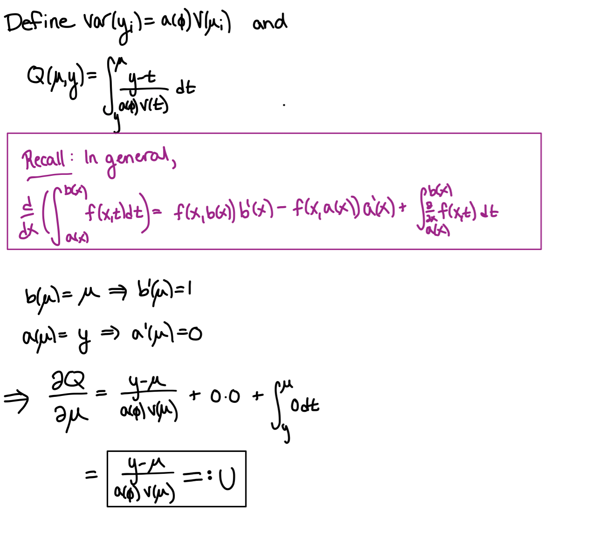{width=400px}


We will show that $U$ defined above behaves like a score (and thus $Q$ behaves like a log likelihood):


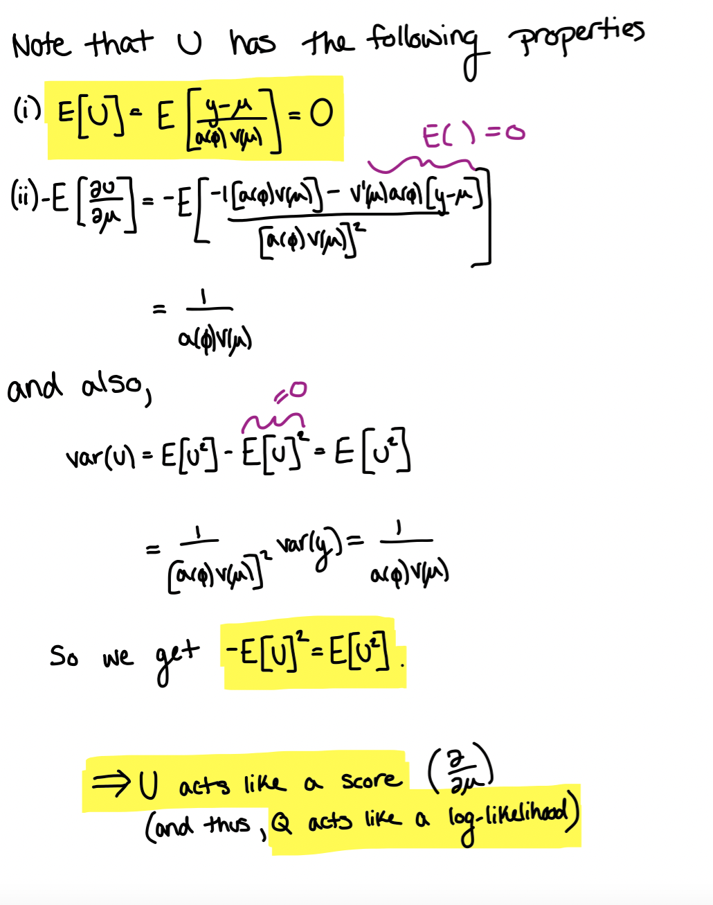{width=350px}


For $n$ (independent) observations we have $$Q(\mu;y):=\sum_{i=1}^nQ(\mu_i;y_i) $$
and we define the quasidevaince as:


<center>

  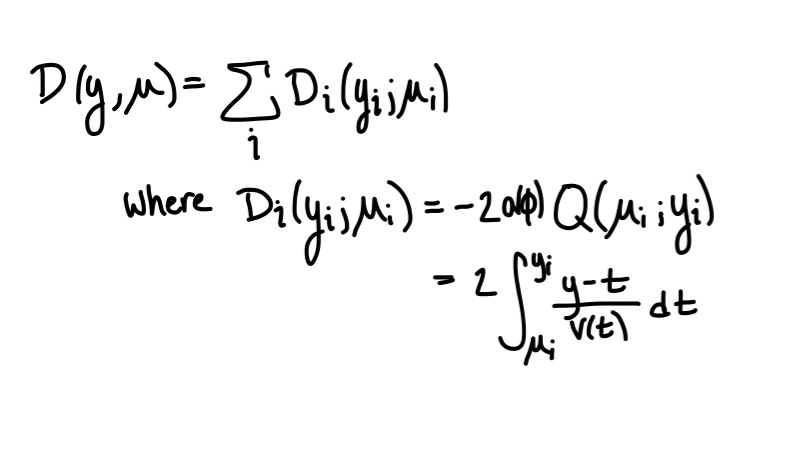{width=275px}


</center>


We can use $Q$ in the same way we use the log likelihood to estimate $\hat{\beta}.$ Namely,


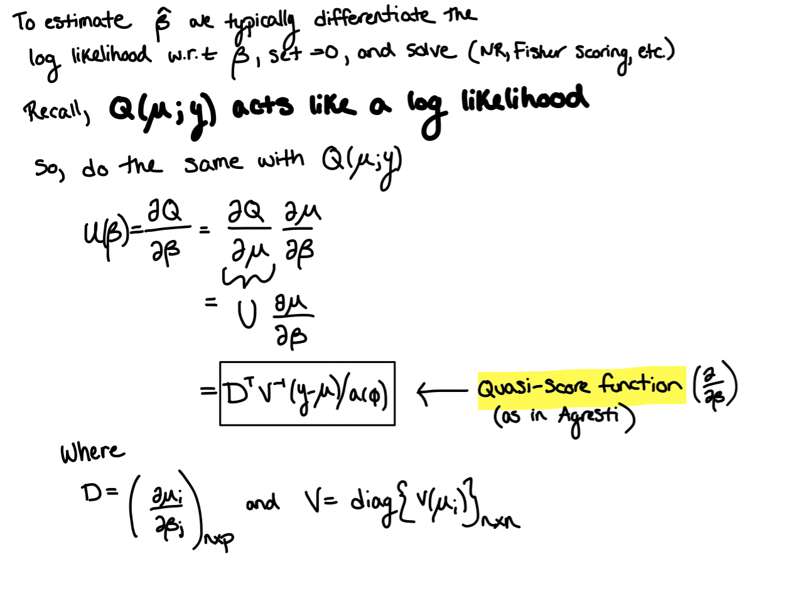{width=450px}


__Note__ that Hongkai introduces QLs starting with $U$ while Agresti starts with $u(\beta)$. Now it should be obvious how the two relate ($U$ is a quasi-score w.r.t. $\mu$ and $u(\beta)$ is the quasi-score for $\beta$).

Also note the ingredients you need are:

* Defined variance function $var(y_i) = a(\phi)v(\mu_i)$ <span style="color: purple;">(input into V and $a(\phi)$ in formula above)</span>
* Link function $\mu_i = g^{-1}(\boldsymbol{x_i}\boldsymbol{\beta})$  <span style="color: purple;">(input $\frac{\delta\mu_i}{\delta\beta_j} = \frac{\delta g^{-1}(\boldsymbol{x_i}\boldsymbol{\beta})}{\delta\beta_j}$ into $D$ and $\mu = \big(g^{-1}(\boldsymbol{x_1}\boldsymbol{\beta}),...,g^{-1}(\boldsymbol{x_n}\boldsymbol{\beta})\big)$ in $(y-\mu)$ above)</span>


We now continue with our typical algorithm to solve for the MLE:

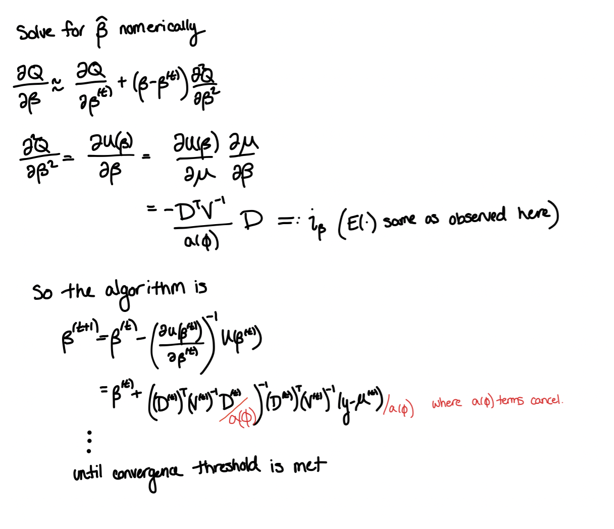{width=475px}


Recall that the asymptotic variance of $\hat{\beta}$ is $$var(\hat{\beta}):=i_\beta = a(\phi)(D^TV^{-1}D)^{-1} $$

## Sampling 

Now that we've gone over how to formulate and fit these models, let's take a step back and think about data and sampling methods and their implications for modeling.

<a name="retro">
</a>

### Retrospective Studies

In a retrospective study, we fix our outcome (say, disease status) columns and the random part lies in the exposure/covariates. That is, we fix the number of cases and controls, and then look back at their covariates to model the relationship between covariates and outcome. Let's think about the $2 \times2$ contingency table example.

<center>

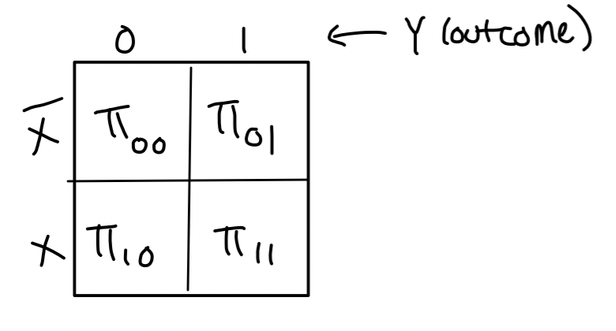{width=250px}

</center>

In a typical logistic model we model
 $$ Pr(y=1) = logit^{-1}\big(X^T\boldsymbol{\beta}\Big) $$
 or
 $$logit\Big(Pr(y=1)\Big)=log\bigg(
 \frac{Pr(y=1)}{1-Pr(y=1)}\bigg)=X^T\boldsymbol{\beta} $$
With just one covariate we have 

$$logit\Big(Pr(y_i=1)\Big)=\beta_0+\beta_1x_1 $$
$$\implies e^{\beta_1}=\frac{e^{\beta_0+\beta_1}}{e^{\beta_0}}\\ = \frac{Pr(y_i=1|x_i=1)/Pr(y_i=0|x_i=1) }{Pr(y_i=1|x_i=0)/Pr(y_i=0|x_i=0)}. $$
Note that we fix the outcomes $y_i$, so we can only estimate $Pr(x_i=1|y_i=k)$ for $k\in\{0,1\}$. Apply Bayes' rule to see that this is not a problem:

<center>

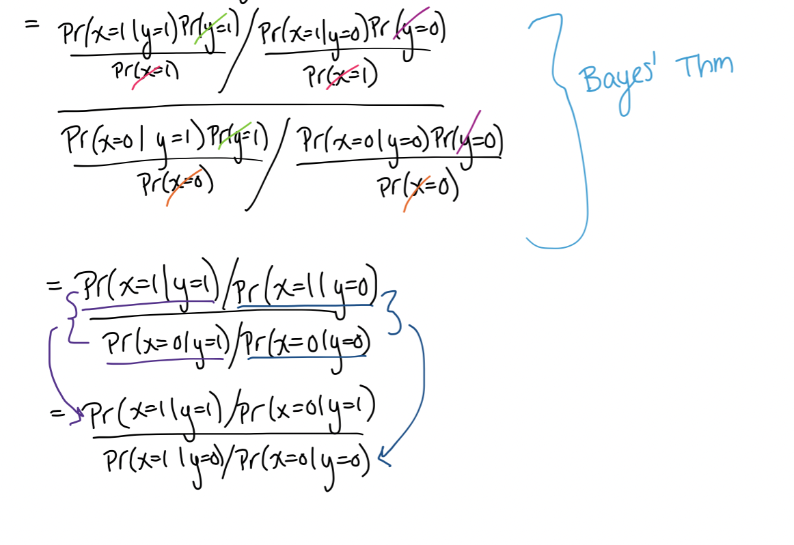{width=400px}

</center>


__Takeaway?__ **Slope coefficients retain their interpretation in the retrospective model** (with case control studies we model probability of exposure given disease status)

However, consider the intercept, which models the (log) odds rather than the (log) odds ratio (difference). In order to do this, we define a variable z which indicates that an individual was sampled. 
That is,

$$z_i = \begin{cases}1 & \text{if person } i \text{ is sampled}\\0 &  \text{otherwise} \end{cases} $$
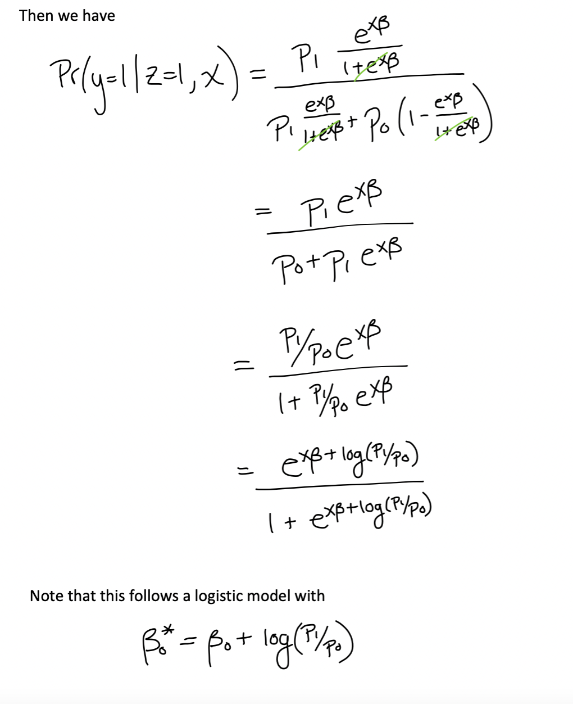{width=450px}

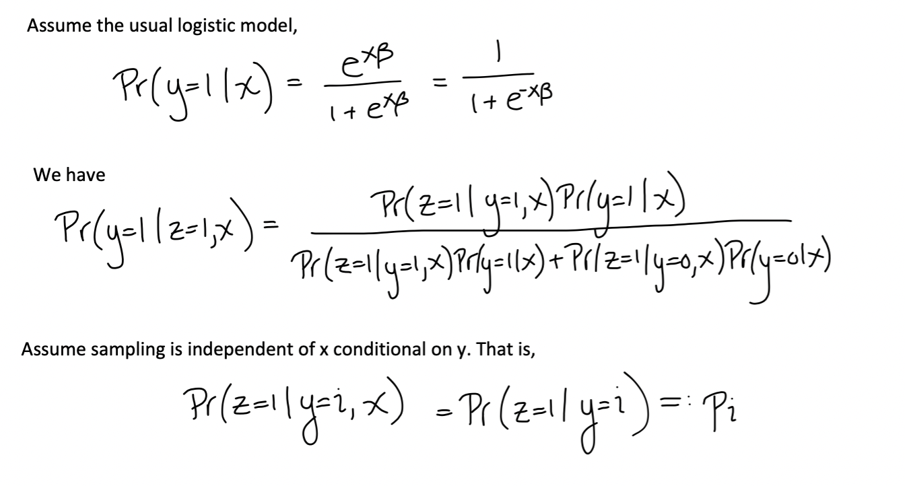{width=300px}


So if we model a retrospective study using the typical logistic model, the coefficients associated with predictors (non-intercept terms) retain their typical interpretation, but the __interpretation of the intercept changes__. Note that __with this data alone we cannot estimate the intercept term because we fix the number of cases and controls__ (can’t estimate probability of each being chosen if they are not chosen randomly).

<a name="match">
</a>

### Matched Case-Control

Let's consider a special type of case control study: the matched case control design.


Consider a scenario where we have $k_i$ controls for every one of $N$ cases, matched on some set of covariates. More formally, let 

$$\begin{cases}y_{i0}=1& \text{ indicate case } i\\
y_{ij}=0, \text{ }j=1,...,m_i& \text{ indicate controls for case }i\end{cases} $$
Also, let $\big(x_{ij1},...,x_{ijp}\big)$ be the vector of covariates for the $j^{th}$ member of the $i^{th}$ group and $z_{ik}$ be the confounding variables that we matched on (so there is only one value per group by construction).

Under typical logistic regression we can write this as

$$logit(\pi_i)=\beta_0+\beta_XX+\beta_ZZ $$
or we can rewrite this as 
$$logit(\pi_i)=\alpha_i+\beta_XX $$
where here $a_i$ is a group parameter. Issue with this? High number of parameters to estimate compared to the number of samples.

#### Conditional Likelihood

To combat this we will try conditioning on the group of matched covariates.

We want to consider $$P(y_{i0}=1,y_{i1}=0,...,y_{im_i}=0 | \sum_{j}y_{ij}=1,X,Z) $$.

Since we consider group members independent we have
$$P(y_{i0}=1,y_{i1}=0,...,y_{im_i}=0 | X,Z)=\frac{e^{\alpha_i+x_{i0}^T\beta}}{1+e^{\alpha_i+x_{i0}^T\beta}}\times\prod_{j=1}^{m_i}\frac{1}{1+e^{\alpha_i+x_{ij}^T\beta}}\\=e^{\alpha_i+x_{i0}^T\beta}\prod_{j=0}^{m_i}\frac{1}{1+e^{\alpha_i+x_{ij}^T\beta}} $$
$$\implies P(\sum_{j}y_{ij}=1|X,Z)=\sum_{j=0}^{m_i}\frac{e^{\alpha_i+x_{ij}^T\beta}}{\prod_{k=0}^{m_i}1+e^{\alpha_i+x_{ik}^T\beta}}\\=\frac{\sum_{j=0}^{m_i}e^{\alpha_i+x_{ij}^T\beta}}{\prod_{k=0}^{m_i}1+e^{\alpha_i+x_{ik}^T\beta}} $$
So, $$P(y_{i0}=1,y_{i1}=0,...,y_{im_i}=0 | \sum_{j}y_{ij}=1,X,Z) = \frac{e^{a_i+x_{i0}^T\beta}}{\sum_{j=0}^{m_i}e^{\alpha_i+x_{ij}^T\beta}}\\=\frac{e^{x_{i0}^T\beta}}{\sum_{j=0}^{m_i}e^{x_{ij}^T\beta}} $$

Notice that under this conditional likelihood structure, the $a_i$ terms fell out of the equations. So conditioning on the groups having one case and their matched covariates we get a model with fewer parameters. __Note__, though, that using this method we can't estimate $\alpha_i.$ This means that __we cannot estimate the effects on any covariate that we match on__. So if you want to estimate the effect of, say, age on outcome, you cannot match on age. This makes sense, since by matching on covariates $Z$ we artificially manipulate the distribution of those covariates (no longer random--by construction there are $m_i-1$ controls and one case with covariates $Z$).


<a name="cont">
</a>

### Testing for Indendence in Contingency Tables

#### Multinomial

There are multiple ways to model contingency table data. Consider a $k\times m$ contingency table (i.e. we have a  categorical variable with $k$ levels and one with $m$ levels) with a total count of $N$. One way we could model this is with a multinomial distribution. Under the hypothesis of independence we have:

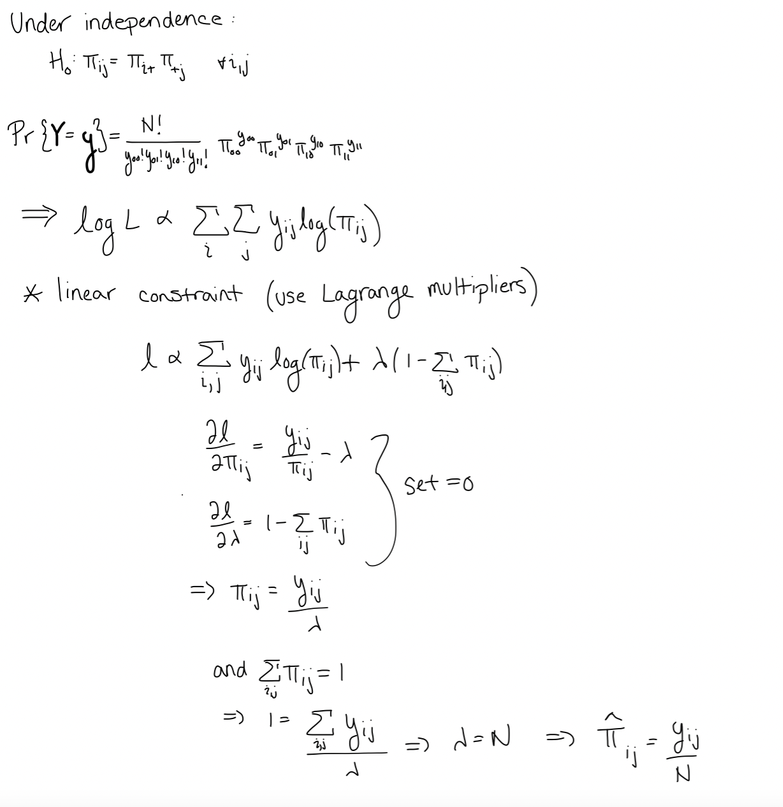{width=450px}

Under the null hypothesis of independence we get
$$\hat{\pi}_{ij}=\hat{\pi}_{i+}\hat{\pi}_{+j}\\=\frac{y_{i+}y_{+j}}{N^2} $$

Thus, our estimates for the mean in each group (proportion times total count) will be 
$$\hat{\mu}_{ij} = N\cdot\hat{\pi}_{ij}= \frac{y_{i+}y_{+j}}{N}$$
We can plug these estimates back into our likelihood to get a deviance test or compare fitted values with the observed data to get a Pearson chi-squared statistic to test the null hypothesis of independence (if we get a significant p-value it implies our estimates are far from the observed data and thus our independence assumption is likely wrong).

#### Poisson

Another way we can model this data is by considering each cell in the contingency table tot be drawn from an independent Poisson distribution. A fully saturated model for this distribution would be to fit a model with one parameter per cell, and thus each observation will be the estimated mean for that cell. This is also equivalent to fitting a model with a covariate for each level of each variable after baseline and all two-way interaction terms. For example, in the $2\times 2$ case we would have:

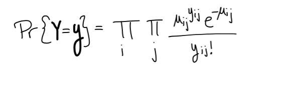{width=400px}

We could also formulate this for the $k\times m$ case as:

$$log(\mu_{ij})=\beta_0+\sum_{i^*}\beta_{i^*}I(i=i^*)+\sum_{j^*}\beta_{k+j^*}I(j=j^*)+\sum_{i^*,j^*}\beta_{k+m+(i^{*}-1)(j^*-1)},$$
where $i^* = 1,2,...,k-1,$ and $j^*=1,2,...,m-1$.

Here we see we are estimating $$1+(k-1)+(m-1)+(k-1)(m-1)\\ = 1+(k-1)+(m-1)+km -k-m+1 = km$$ parameters, so this is the fully saturated model.

If we drop the interaction terms, we are left with 
$$log(\mu_{ij})=\beta_0+\sum_{i^*}\beta_{i^*}I(i=i^*)+\sum_{j^*}\beta_{k+j^*}I(j=j^*). $$
Note that dropping the interaction terms in the model means that we are assuming all of their coefficients are zero. That is, we assume the variables are independent. Thus, fitting the additive model above and comparing its fit (via deviance or chi-squared test) to the saturated model is the same as testing for all interactions having coefficients of zero, i.e. independence.

#### Equivalence of Multinomial and Poisson

Note that under the null hypothesis for the multinomial setting we estimate 
$$\hat{\mu}_{ij}=\frac{y_{i+}y_{+j}}{N}, $$
which relies only on the row and column sums in the contingency table, i.e. the marginal structure of our variables. Likewise, for the additive log-linear model we have 
$$log(\mu_{ij})=\beta_0+\sum_{i^*}\beta_{i^*}I(i=i^*)+\sum_{j^*}\beta_{k+j^*}I(j=j^*)\\\implies \mu_{ij}=e^{\beta_0}e^{\beta_i}e^{\beta_k+j},$$
which also only depends on the marginal structure. So the systematic components of the models agree.

We also know that conditioning Poisson distributions on the total sum yields the multinomial case; so the random components also agree. It shouldn't come as a surprise, then, that the two models yield the same estimates.